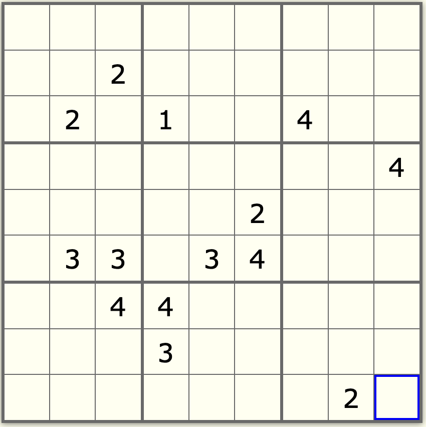
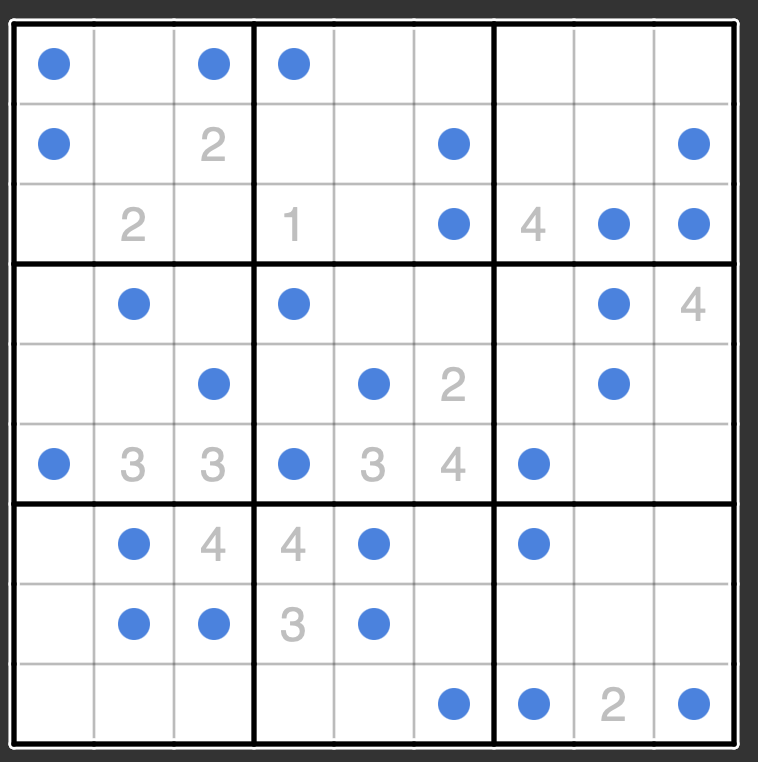

# kyoto-protocol Writeup

## Introduction (author notes)

This is probably one of my most evil concoctions yet. After I wrote the challenge, I figured
that solving this by hand would be the most painful thing ever, and I planned to never release it.

But, the other members wanted me to do so anyway, so I unleashed it (also I had to take revenge on arclbroth's reflection challenge that was evil)

This is one of the attempts to outsmart AI (since the binary can't be gdb'd and uses some weird way to run code) but it got solved anyway in testing.

There are many ways you could have solved this challenge; hopefully you had to get creative (or used AI to solve it :| )

## Overview

Bash scripts have a quirk that if the current running script is edited, bash will execute the newly written lines. This challenge works by having bash call the binary, which then writes back to the bash script (with a few arguments to indicate what operation to do next).

We can dump a list of all the calls run using `bash -v chall.sh`.

```
export g_4545=79
./chall $LINENO 436
export g_9999=92
./chall $LINENO 1497
export g_1277=67
./chall $LINENO 3864
export g_4387=84
./chall $LINENO 485
export g_4412=75
./chall $LINENO 4726
export g_8694=93
./chall $LINENO 1316
export g_4968=72
./chall $LINENO 7760
export g_2431=15
./chall $LINENO 5544
export g_3694=27
./chall $LINENO 1913
echo "Enter the password:"
Enter the password:
./chall $LINENO 2339
read -n 100 input
```

Looking through the binary, we see that if the the binary sees more than two arguments (or is run without any args), `sub_aa9a` is called.

If the binary is run without any args, the binary writes the following to the bash script:

```
write_shebang()
write_line("int () {", 1)
write_line("./chall $LINENO 999999", 2)
write_line("exit", 3)
write_line("}", 4)
write_line("trap "int" INT", 5)
write_line("./chall $LINENO 9823", 6)
```

This resets the state if the bash script is ever CTRL-C'd. If the binary is called with at least two arguments, the binary runs through a list of number-callback pairs to determine what operation to run.

```c
int32_t id_lcl[0x5b2]
void* func_lcl[0x5b2]
memcpy(&func_lcl, &function_table, 0x2d90) // table of 0x5b2 = 1458 callback pointers
memcpy(dest: &id_lcl, src: &id_table, n: 0x16c8) // table of 0x5b2 ints (ids)
int32_t idx = 0

while (true)
    if (idx > 0x5b1)
        write_shebang()
        close_and_exit(0)
        noreturn
    // the decomp is a bit messed up here but rax_11
    // is the second supplied number
    if (rax_11 == id_lcl[idx])
        break

    idx += 1

jump(func_lcl[idx]) // jump to specified callback
```

## Operation Hell

Looking at the first operation that is run (id 9823, sub_12601), we have the following (cleaned up):

```c
// this decomp is messed up since we jumped using the jump table,
// making all the local vars incorrect (they are now offsets from rbp, or arg1)

// clear arg2 lines before line arg1
clear_before_line(*(arg1 - 0x460c), 7)
// arg1 - 0x100 is probably some temp buffer
snprintf(s: arg1 - 0x100, maxlen: 0xc8, format: "export g_1117=%d", 0x2c)
write_line(arg1 - 0x100, (global_offset++) + *(arg1 - 0x460c))
write_line("./chall $LINENO 4098", (global_offset++) + *(arg1 - 0x460c))
close_and_exit(0)
noreturn
```

Since all the local variables are messed up, we can do a bit of debugging to figure out what `*(arg1 - 0x460c)` is.
Using GDB, we find that `*(arg1 - 0x460c)` points to the first supplied number, which matches how each written command
uses `$LINENO` as the first numeric argument. This is used to offset all writes inside the file.

I used IDA scripting to dump all the function decompilations to files. See `dump.py` for the script.
Now, we can try to parse the decompiled output into simple VM operations that we can run.

I wrote another script, `parse.py` that parses IDA's decompilations to simple VM operations (very scuffed). If you want to test it out,
first unzip the `dumped_c` zip before running.

The VM consists of only JUMP, NEXT, and EXPORT instructions (with a few exceptions). Most of the computation happens
in the arguments that are passed to the next operation. Running `vm.py` after parsing will display the following:

```
2339 |                     | NEXT: -> 8275
8275 |                     | NEXT: -> 8947
8947 |                     | WRITE: "Checking... (this may take a while)"
8947 |                     | NEXT: -> 6165
6165 |                     | NEXT: -> 7104
7104 |                     | NEXT: -> 6550                                      | 0 0
6550 | 0 0                 | NEXT: -> 3771                                      | . . arg0
3771 | 0 0 0               | JUMP (arg2 <= 9) ? ->3827 : 1421                   | . . .
3827 | 0 0 0               | JUMP (arg2 != 0) ? 4429 : ->6177                   | . . .
6177 | 0 0 0               | NEXT: -> 4766                                      | . . env(i0)
4766 | 0 0 49              | JUMP (arg2 == 0) ? 3839 : ->446                    | . . .
0446 | 0 0 49              | JUMP (arg2 > 48) ? ->75 : 2016                     | . . .
0075 | 0 0 49              | JUMP (arg2 <= 57) ? ->9782 : 2016                  | . . .
9782 | 0 0 49              | NEXT: -> 7415                                      | . . (arg2 - 49)
7415 | 0 0 0               | NEXT: -> 9825                                      | . . .
```

The first column displays the function id number of each operation. The second column displays the current arguments in use.
The third column displays the operation, and the fourth column displays how the arguments for the next operation are calculated (dots mean the previous value is retained).

We can "check" that our VM is correct by comparing the output to the stuff printed by `bash -v chall.sh`. Now that we have a working recreation of the challenge, we can start analyzing the program.

## The Start of the Analysis

At the start of the program, the VM sets a bunch of variables to random numbers (we will keep these in mind for later):
```
9823 |                     | EXPORT: g_1117 = 44
9823 |                     | NEXT: -> 4098
4098 |                     | EXPORT: g_5601 = 86
4098 |                     | NEXT: -> 5395
5395 |                     | EXPORT: g_1559 = 41
5395 |                     | NEXT: -> 9734
9734 |                     | EXPORT: g_3297 = 58
9734 |                     | NEXT: -> 8107
8107 |                     | EXPORT: g_8262 = 65
8107 |                     | NEXT: -> 5441
5441 |                     | EXPORT: g_5115 = 57
5441 |                     | NEXT: -> 8682
8682 |                     | EXPORT: g_3049 = 34
8682 |                     | NEXT: -> 369
0369 |                     | EXPORT: g_5572 = 98
0369 |                     | NEXT: -> 4284
4284 |                     | EXPORT: g_6199 = 85
4284 |                     | NEXT: -> 5954
5954 |                     | EXPORT: g_6630 = 57
5954 |                     | NEXT: -> 5707
5707 |                     | EXPORT: g_2671 = 82
5707 |                     | NEXT: -> 5596
5596 |                     | EXPORT: g_1611 = 36
...
```

Then, after printing "Enter the password:", the user is asked for input:

```
1913 |                     | WRITE: "Enter the password:"
1913 |                     | NEXT: -> 2339
2339 |                     | READ:
>
```

We can try to black box some sections of the code by putting some recognizable characters. I'll put `ABCDEFGHIJKLMNOP` as the password for now.

After the input is taken in, we see the following:

```
>ABCDEFGHIJKLMNOP
2339 |                     | NEXT: -> 8275
8275 |                     | NEXT: -> 8947
8947 |                     | WRITE: "Checking... (this may take a while)"
8947 |                     | NEXT: -> 6165
6165 |                     | NEXT: -> 7104
7104 |                     | NEXT: -> 6550                                      | 0 0
6550 | 0 0                 | NEXT: -> 3771                                      | . . arg0
3771 | 0 0 0               | JUMP (arg2 <= 9) ? ->3827 : 1421                   | . . .
3827 | 0 0 0               | JUMP (arg2 != 0) ? 4429 : ->6177                   | . . .
6177 | 0 0 0               | NEXT: -> 4766                                      | . . env(i0)
4766 | 0 0 65              | JUMP (arg2 == 0) ? 3839 : ->446                    | . . .
0446 | 0 0 65              | JUMP (arg2 > 48) ? ->75 : 2016                     | . . .
0075 | 0 0 65              | JUMP (arg2 <= 57) ? 9782 : ->2016                  | . . .
2016 | 0 0 65              | NEXT: -> 3090                                      | . . 5
3090 | 0 0 5               | NEXT: -> 9587                                      | . . (arg2 + arg0)
9587 | 0 0 5               | NEXT: -> 4355                                      | . . (arg2 * 3)
4355 | 0 0 15              | NEXT: -> 2429                                      | . . (arg2 % 7)
2429 | 0 0 1               | NEXT: -> 9825                                      | . . (arg2 + 81)
9825 | 0 0 82              | NEXT: -> 8297                                      | . . . (arg0 % 2)
8297 | 0 0 82 0            | JUMP (arg3 == 0) ? ->4060 : 2422                   | . . .
4060 | 0 0 82              | NEXT: -> 6907                                      | . arg2
6907 | 0 82                | NEXT: -> 1592                                      | . (arg1 * 9)
1592 | 0 738               | NEXT: -> 2475                                      | . .
2475 | 0 738               | NEXT: -> 4945                                      | (arg0 + 1) .
4945 | 1 738               | NEXT: -> 6550                                      | . .
```

We see that the first letter `A` (charcode 65) appears in the arguments list! This is because `env(i0)` is placed at `arg2` as seen in the 4th column.

Note that at 0446 and 0075, our character is checked whether it is between 49 and 57, which coincide with the characters `1-9`. From this, we should adjust our password so that it consists of only `1-9`. Let's use `123456789`.

Now, we see that the logic has changed a bit:

```
>123456789
2339 |                     | NEXT: -> 8275
8275 |                     | NEXT: -> 8947
8947 |                     | WRITE: "Checking... (this may take a while)"
8947 |                     | NEXT: -> 6165
6165 |                     | NEXT: -> 7104
7104 |                     | NEXT: -> 6550                                      | 0 0
6550 | 0 0                 | NEXT: -> 3771                                      | . . arg0
3771 | 0 0 0               | JUMP (arg2 <= 9) ? ->3827 : 1421                   | . . .
3827 | 0 0 0               | JUMP (arg2 != 0) ? 4429 : ->6177                   | . . .
6177 | 0 0 0               | NEXT: -> 4766                                      | . . env(i0)
4766 | 0 0 49              | JUMP (arg2 == 0) ? 3839 : ->446                    | . . .
0446 | 0 0 49              | JUMP (arg2 > 48) ? ->75 : 2016                     | . . .
0075 | 0 0 49              | JUMP (arg2 <= 57) ? ->9782 : 2016                  | . . .
9782 | 0 0 49              | NEXT: -> 7415                                      | . . (arg2 - 49)
7415 | 0 0 0               | NEXT: -> 9825                                      | . . .
9825 | 0 0 0               | NEXT: -> 8297                                      | . . . (arg0 % 2)
8297 | 0 0 0 0             | JUMP (arg3 == 0) ? ->4060 : 2422                   | . . .
4060 | 0 0 0               | NEXT: -> 6907                                      | . arg2
6907 | 0 0                 | NEXT: -> 1592                                      | . (arg1 * 9)
1592 | 0 0                 | NEXT: -> 2475                                      | . .
2475 | 0 0                 | NEXT: -> 4945                                      | (arg0 + 1) .
4945 | 1 0                 | NEXT: -> 6550                                      | . .
6550 | 1 0                 | NEXT: -> 3771                                      | . . arg0
3771 | 1 0 1               | JUMP (arg2 <= 9) ? ->3827 : 1421                   | . . .
3827 | 1 0 1               | JUMP (arg2 != 0) ? ->4429 : 6177                   | . . .
4429 | 1 0 1               | JUMP (arg2 == 1) ? ->5328 : 1831                   | . . .
5328 | 1 0 1               | NEXT: -> 4766                                      | . . env(i1)
```

Notice how the program structures looks somewhat like a for loop; the first argument keeps track of which character it's reading
and it increments at instruction 2475. Each loop reads in one character (you can see the `env(i#)` args on the right).

Following where our input goes, we see that 49 is subtracted from our input, meaning the characters `1-9` become the numbers `0-8`.
Then, there is a check based on the current index number `arg0` at 9825.

If the index is even, the number is placed at `arg1` and is multiplied by 9.

```
9825 | 0 0 0               | NEXT: -> 8297                                      | . . . (arg0 % 2)
8297 | 0 0 0 0             | JUMP (arg3 == 0) ? ->4060 : 2422                   | . . .
4060 | 0 0 0               | NEXT: -> 6907                                      | . arg2
6907 | 0 0                 | NEXT: -> 1592                                      | . (arg1 * 9)
1592 | 0 0                 | NEXT: -> 2475                                      | . .
```

If it is odd, the new number is added to the existing `arg1` and some variable is set based off the sum.
```
9825 | 1 0 1               | NEXT: -> 8297                                      | . . . (arg0 % 2)
8297 | 1 0 1 1             | JUMP (arg3 == 0) ? 4060 : ->2422                   | . . .
2422 | 1 0 1               | NEXT: -> 3407                                      | . (arg1 + arg2)
3407 | 1 1                 | NEXT: -> 3053                                      | . .
3053 | 1 1                 | JUMP (arg1 <= 9) ? ->8257 : 7762                   | . .
8257 | 1 1                 | JUMP (arg1 != 0) ? ->4950 : 982                    | . .
4950 | 1 1                 | JUMP (arg1 == 1) ? ->8248 : 2590                   | . .
8248 | 1 1                 | EXPORT: g_8356 = 17
```

From this, we can conclude that our input must come in pairs of the numbers `1-9`. Considering the multiplication by 9,
this somewhat resembles a 9x9 grid, where the pair of numbers represents the x and y coordinates. Now, our goal is to
supply a list of points that is valid.


## This looks familiar

After the program finishes exporting variables based on our points, it does the following:

```
5406 |                     | NEXT: -> 7776                                      | 0 57
7776 | 0 57                | NEXT: -> 9623                                      | . . 0 0 arg1
9623 | 0 57 0 0 57         | JUMP (arg2 != 0) ? 3849 : ->1533                   | . . . . .
1533 | 0 57 0 0 57         | NEXT: -> 8635                                      | . . . . . (arg4 % 9)
8635 | 0 57 0 0 57 3       | JUMP (arg5 > 0) ? ->3201 : 949                     | . . . . .
3201 | 0 57 0 0 57         | NEXT: -> 1778                                      | . . . . . (arg4 / 9)
1778 | 0 57 0 0 57 6       | JUMP (arg5 > 0) ? ->9615 : 949                     | . . . . .
9615 | 0 57 0 0 57         | NEXT: -> 245                                       | . . . . (arg4 - 10)
0245 | 0 57 0 0 47         | NEXT: -> 2609                                      | . . . . .
2609 | 0 57 0 0 47         | NEXT: -> 4835                                      | . . . . . 0
4835 | 0 57 0 0 47 0       | JUMP (arg4 <= 9) ? 8222 : ->5739                   | . . . . . .
5739 | 0 57 0 0 47 0       | JUMP (arg4 <= 19) ? 8019 : ->6319                  | . . . . . .
6319 | 0 57 0 0 47 0       | JUMP (arg4 <= 29) ? 571 : ->3921                   | . . . . . .
3921 | 0 57 0 0 47 0       | JUMP (arg4 <= 39) ? 8317 : ->6946                  | . . . . . .
6946 | 0 57 0 0 47 0       | JUMP (arg4 <= 49) ? ->6264 : 3194                  | . . . . . .
6264 | 0 57 0 0 47 0       | JUMP (arg4 == 40) ? 3292 : ->5760                  | . . . . . .
5760 | 0 57 0 0 47 0       | JUMP (arg4 == 41) ? 5493 : ->8221                  | . . . . . .
8221 | 0 57 0 0 47 0       | JUMP (arg4 == 42) ? 1324 : ->8118                  | . . . . . .
8118 | 0 57 0 0 47 0       | JUMP (arg4 == 43) ? 377 : ->6440                   | . . . . . .
6440 | 0 57 0 0 47 0       | JUMP (arg4 == 44) ? 9469 : ->184                   | . . . . . .
0184 | 0 57 0 0 47 0       | JUMP (arg4 == 45) ? 875 : ->1743                   | . . . . . .
1743 | 0 57 0 0 47 0       | JUMP (arg4 == 46) ? 9031 : ->7147                  | . . . . . .
7147 | 0 57 0 0 47 0       | JUMP (arg4 == 47) ? ->572 : 8852                   | . . . . . .
0572 | 0 57 0 0 47 0       | NEXT: -> 6775                                      | . . . . env(g_4136) .
6775 | 0 57 0 0 82 0       | JUMP (arg5 != 0) ? 6464 : ->267                    | . . . . .
0267 | 0 57 0 0 82         | NEXT: -> 1730                                      | . . . . (arg4 % 7)
1730 | 0 57 0 0 5          | JUMP (arg4 == 3) ? 9932 : ->949                    | . . . .
0949 | 0 57 0 0            | NEXT: -> 7186                                      | . . (arg2 + 1) .
```

This segment of the code starts off by doing what seems to be a bounds check (checking if the x/y coordinates are over 0).
Then, 10 is subtracted from the hardcoded number. If we consider a 9x9 grid, an offset of -10 would correspond to an offset of -1 in both the x and y direction, explaining the bounds check at the start.

After that, the program fetches some export based off the new number. It then checks if the `value % 7 == 3`, which is a very weird check! But, recall that the variable `g_4136` was one of the variables set at the start of the program! If we take the mod 7
of every initial value, we find that none of them equal to 3 ! *(besides one, challenge error that doesn't affect final output)*

Additionally, if we look back at the input parsing section, every exported variable mod 7 is equal to 3! This means that
this section checks for any points that were marked by our input.

If one of the checked squares was marked by us, `arg3` is incremented by 1.

```
1730 | 2 49 2 0 3          | JUMP (arg4 == 3) ? ->9932 : 949                    | . . . .
9932 | 2 49 2 0            | NEXT: -> 949                                       | . . . (arg3 + 1)
0949 | 2 49 2 1            | NEXT: -> 7186                                      | . . (arg2 + 1) .
7186 | 2 49 3 1            | NEXT: -> 9623                                      | . . . . arg1
```

After the program checks for offset 10, it loops through and checks for other marked squares at different offsets.
These offsets are -10, -9, -8, -1, +1, +8, +9, +10, or the 8 surrounding squares. This means the program is just counting
how many marked squares there are in the surrounding 8 squares. This seems suspiciously similar to Minesweeper...

Note that `arg0` increments by 1 and `arg1` (the coordinate to check) changes every time we check all 8 squares.
At the end of every check, one of the exports is updated:
```
9840 | 0 0                 | NEXT: -> 3068                                      | env(g_8694) .
3068 | 93 0                | NEXT: -> 5709                                      | (arg0 * 11) .
5709 | 1023 0              | EXPORT: g_8694 = 1023 ; (arg0 + arg1)
```
The previous value of `g_8694` is multiplied by 11 and the surrounding mine count is added. This means that `g_8694` stores
the mine clues for the entire puzzle!

This process is repeated for another export `g_4968` for the back half of the checks:
```
1152 | 7 0                 | NEXT: -> 1200                                      | env(g_4968) .
1200 | 72 0                | NEXT: -> 3196                                      | (arg0 * 11) .
3196 | 792 0               | EXPORT: g_4968 = 792 ; (arg0 + arg1)
```

Looking at the check functions, we see that the correct values are `g_8694=1820085546` and `g_4968=1410707190`. We can convert
both numbers to base 11 to obtain the clue numbers!

Note that both variables were initialized with some garbage values, so we can ignore the first few digits and only look at the
last 7 digits (since 7 checks were performed on each number).

From this, we get the following clues:

```
57: 4
24: 4
49: 3
46: 3
11: 2
47: 3
56: 4
35: 4
66: 3
50: 4
19: 2
79: 2
21: 1
41: 2
```



Now that we have all the clues, we can try submitting a solution that fulfills all the minesweeper requirements, but we still find that our solution is incorrect! Maybe there's another check we need to reverse.

## What did they do to minesweeper :(

After the minesweeper check, we find the next check:

```
8196 |                     | NEXT: -> 9173
9173 |                     | NEXT: -> 6135
6135 |                     | NEXT: -> 7699                                                | (env(g_1559) % 7)
7699 | 6                   | NEXT: -> 8258                                                | . (13 * env(g_2431))
8258 | 6 195               | EXPORT: g_2431 = 201 ; (arg0 + arg1)
8258 | 6 195               | NEXT: -> 9731
9731 |                     | NEXT: -> 8850                                                | (env(g_3333) % 7)
8850 | 5                   | NEXT: -> 5551                                                | . (13 * env(g_2431))
5551 | 5 2613              | EXPORT: g_2431 = 2618 ; (arg0 + arg1)
5551 | 5 2613              | NEXT: -> 9007
9007 |                     | NEXT: -> 6055                                                | (env(g_2988) % 7)
6055 | 1                   | NEXT: -> 5247                                                | . (13 * env(g_2431))
5247 | 1 34034             | EXPORT: g_2431 = 34035 ; (arg0 + arg1)
5247 | 1 34034             | NEXT: -> 367
0367 |                     | NEXT: -> 2638                                                | (env(g_7941) % 7)
2638 | 1                   | NEXT: -> 1526                                                | . (13 * env(g_2431))
1526 | 1 442455            | EXPORT: g_2431 = 442456 ; (arg0 + arg1)
1526 | 1 442455            | NEXT: -> 9130
9130 |                     | NEXT: -> 478                                                 | (env(g_7622) % 7)
...
```

This part of the code seems to be taking the mod 7 remainders of all squares with clues in them. By checking the correct value of `g_2431`, we can see that without any mines on the board, this check is satisfied. If we were to place a mine directly on a clue square, this checksum would change. This part basically means that we are not allowed to place mines on any clue number.

For the final check, the program runs through all 81 squares and checks for any mines present.
```
9567 | 80                  | JUMP (arg0 == 80) ? ->2134 : 1774
2134 |                     | NEXT: -> 8045                                                | (env(g_7534) + 8)
8045 | 11                  | JUMP (arg0 == 48) ? 2858 : ->9056
9056 |                     | EXPORT: g_7965 = 1000 ; (env(g_7965) + 1000)
9056 |                     | NEXT: -> 8108
8108 |                     | EXPORT: g_1829 = 10000000 ; (env(g_1829) + 10000000)
8108 |                     | NEXT: -> 2585
2585 |                     | EXPORT: g_2184 = 100000 ; (env(g_2184) + 100000)
2585 |                     | NEXT: -> 2858
2858 |                     | NEXT: -> 9127                                                | (env(g_2328) + 2)
9127 | 35                  | JUMP (arg0 == 35) ? ->63 : 3904
0063 |                     | NEXT: -> 3423                                                | (env(g_2788) + 4)
3423 | 94                  | JUMP (arg0 == 94) ? ->7513 : 7125
7513 |                     | NEXT: -> 7588                                                | (env(g_9120) + 3)
7588 | 41                  | JUMP (arg0 == 64) ? 5226 : ->7990
7990 |                     | EXPORT: g_7965 = 100001000 ; (env(g_7965) + 100000000)
7990 |                     | NEXT: -> 2390
2390 |                     | EXPORT: g_1829 = 10100000 ; (env(g_1829) + 100000)
2390 |                     | NEXT: -> 1729
1729 |                     | EXPORT: g_2184 = 10100000 ; (env(g_2184) + 10000000)
1729 |                     | NEXT: -> 5226
```

If there is a mine present, it modifies three variables by adding a hardcoded number based on the grid position.
We can try placing a mine at a bunch of squares to see how the three variables change.

Filling in mines in one row (111213141516171819) causes `g_7965` to equal `9`. Filling in all the mines in the second row (212223242526272829) causes it to equal `90`. It seems like this variable keeps track of the number of mines in each row, with
each digit representing a different row.

Similarly, filling in all mines in a column (112131415161718191) causes `g_1829` to equal `9`. This means that `g_1829` similarly keeps track of all the columns.

Since we're in a 9x9 grid, of course we need to try squares (it's very similar to sudoku after all). Filling in a square (111213212223313233) shows that the last variable `g_2184` checks all the squares.

Looking at the final check, the program expects all three variables to equal 333333333. This means that in every row, column and square, there must be exactly 3 mines.

Now that we know the full puzzle, we can solve it!

Here is the solution:



Inputting `111314212629363839424448535558616467727577828385969799` and running `cat flag.txt`, we get the flag!

If you haven't heard of this game before, check out [this website](https://circle9puzzle.com/bbtrio/) :)
